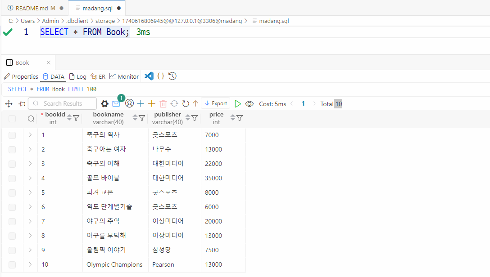

# iot-database-2025
iot 개발자 데이터베이스 저장소

## 1일차
- 데이터베이스 시스템
    - 통합된 데이터를 저장해서 운영하면서, 동시에 여러사람이 사용할 수 있도록 하는 시스템
    - 실시간 접근, 계속 변경, 동시 공유가 가능, 내용으로 참조(물리적으로 떨어져 있어도 사용가능)
    
    - DBMS - SQL Server, Oracle, MySQL, MariaDB, MongoDB...

- 데이터베이스 언어
    - SQL - Structured Query Language. 구조화된 질의 언어(프로그래밍언어와 동일)
        - DDL : DB나 테이블 생성, 수정, 삭제 언어
        - DML : 데이터 검색, 삽입, 수정, 삭제 언어
        - DCL : 권한 부여, 해제 제어 언어

- MySQL 설치 (Docker)
    1. 파워셀을 오픈
        ```shell
        > docker -v
        Docker version 27.5.1, build 9f9e405
        ```

    2. MySQL Docker 이미지 다운로드
        ```shell
        > docker pull mysql
        Status: Downloaded newer image for mysql:latest
        docker.io/library/mysql:latest
        ```

    3. MySQL Image 확인
        ```shell
        > docker images
        REPOSITORY   TAG       IMAGE ID       CREATED       SIZE
        mysql        latest    146682692a3a   4 weeks ago   1.09GB
        ```

    4. Docker 컨테이너 생성
        - MYSQL Port 번호는 3306이 기본
        - Oracle Port  1521
        - SQL server 1433
        ```shell
        > docker run --name mysql-container -e MYSQL_ROOT_PASSWORD=12345 -d -p 3306:3306 mysql:latest
        ```

    5. 컨테이너 확인
        ```shell
        > docker ps -a
        CONTAINER ID   IMAGE          COMMAND                   CREATED          STATUS          PORTS
        NAMES
        16fec42319db   mysql:latest   "docker-entrypoint.s…"   20 seconds ago   Up 19 seconds   0.0.0.0:3306->3306/tcp, 33060/tcp   mysql-container
        ```

    6. Docker 컨테이너 시작, 중지, 재시작
        ```shell
        > docker stop mysql-container      # 중지
        > docker start mysql-container     # 시작
        > docker restart mysql-container   # 재시작
        ```

    7. MySQL Docker 컨테이터 접속
        ```shell
        > docker exec -it mysql-container bash # bash: 리눅스의 powershell
        bash-5.1# mysql -u root -p
        Enter password:
        Welcome to the MySQL monitor.  Commands end with ; or \g.
        Your MySQL connection id is 10
        Server version: 9.2.0 MySQL Community Server - GPL

        Copyright (c) 2000, 2025, Oracle and/or its affiliates.

        Oracle is a registered trademark of Oracle Corporation and/or its
        affiliates. Other names may be trademarks of their respective
        owners.

        Type 'help;' or '\h' for help. Type '\c' to clear the current input statement.

        mysql> show databases;
        +--------------------+
        | Database           |
        +--------------------+
        | information_schema |
        | mysql              |
        | performance_schema |
        | sys                |
        +--------------------+
        4 rows in set (0.01 sec)
        ```


- Workbench 설치
    - https://dev.mysql.com/downloads/workbench/  MySQL Installer 8.0.41 다운로드설치
    - MySQL Installer에서 Workbench, Sample 만 설치

    - Workbench 실행 후
        1. MySQL Connections + 클릭
    
- 관계 데이터 모델
    - 3단계 DB 구조 : 외부 스키마(실세계와 매핑) -> 개념 스키마(DB논리적 설계) -> 내부 스키마(물리적 설계) -> DB
    - 모델에 쓰이는 용어
        - 릴레이션 - 테이블과 매핑
        - 속성 - 테이블 column
        - 튜플 - 테이블 row
        - 관계 - 릴레이션 간의 부모, 자식 연관
    
    - `무결성 제약조건`
        - 키 - **기본키**, **외래키**, 슈퍼키, 후보키, 대리키, 대체키
        - 개체 무결성 제약조건, 참조 무결성 제약조건, 도메인 무결성 제약조건

- SQL 기초
    - SQL 개요

    ```sql
    -- DML SELECT 문
    SELECT publisher, price
	FROM Book
    WHERE bookname = '축구의 역사'; -- 주석임
    ```

## 2일차
- SQL 기초
    - 개요
        - 데이터베이스에 있는 데이터를 추출 및 처리작업을 위해서 사용되는 프로그래밍언어
        - 일반프로그래밍언어와 차이점
            - DB에서만 문제해결 가능
            - 입출력을 모두 DB에서 테이블로 처리
            - 컴파일 및 실행은 DBMS가 수행
        - DML(데이터 조작어) - 검색, 삽입, 수정, 삭제
            - SELECT, INSERT, UPDATE, DELETE
        - DDL(데이터 정의어)
            - CREATE, ALTER, DROP
        - DCL(데이터 제어어)
            - GRANT, REVOKE

    - DML 중 SELECT

        ```sql
        -- SELECT문 기본문법
        SELECT [ALL|DISTINCT] 컬럼명(들)
          FROM 테이블명(들)
         [WHERE 검색조건(들)]
         [GROUP BY 속성이름(들)]
         [HAVING 집계함수 검색조건(들)]
         [ORDER BY 정렬할속성(들) [ASC|DESC]]
          [WITH ROLLUP]

        ```

        - 쿼리 연습(정렬까지) : [SQL](./day02/db02_select쿼리연습.sql)
        - 쿼리 연습(집계함수부터) : [SQL](./day02/db03_select_집계함수부터.sql)
 
## 3일차
- Visual Studio Code에서 MySQL 연동
    - 확장 > MySQL 검색
        - Weijan Chen 개인개발자 만든 MySQL 확장도 준수
        - Weijan Chen 개발한 Database Client를 설치(추천)
            - 데이터베이스 아이콘 생성
        - Database Client 는 많은 DB 연결이 가능!
        - Oracle에서 개발한 MySQL Shell for VS Code를 사용 하지말것(너무 불편함)
    - Database Client
        1. 툴바 Database 아이콘 클릭
        2. Create Connection 클릭
        3. 정보 입력 > 연결 테스트
        
        4. Workbench 처럼 사용
        


- SQL 기초
    - 기본 데이터형
        - 데이터베이스에는 엄청 많은 데이터형이 존재(데이터의 사이즈 저장용량을 절약하기 위해서)
        - 주요 데이터형 
            - SmallInt(2Byte) - 65535가지 수(음수포함)를 저장(-32768 ~ 32767)
            - **Int(4)** - 모든 데이터타입의 기준! 42억 정수(음수)를 저장
            - BigInt(8) - Int보다 더 큰수 저장
            - Float(4) - 소수점아래 7자리까지 저장
            - Decimal(5~17byte) - Float보다 더 큰 수 저장시
            - Char(n) - n은 가변(1 ~ 255), 고정길이 문자열
                - 주의점! Char(10)에 Hello 글자를 입력하면 **"Hello     "**과 같이 저장!
            - VarChar(n) - n(1 ~ 65535), 가변길이 문자열
                - 주의점! Varchar(10)에 Hello를 입력하면 **"Hello"** 저장됨
            - LongText (최대 4GB) - 뉴스나 영화스크립트 저장할 때 사용
            - LongBlob(최대 4GB) - mp3, mp4 음악, 영화데이터 잦체 저장할 때 사용
            - Date(3) - 2025-02-27 까지 저장하는 타입
            - DateTime(8) - 2025-02-27 10:45:34 까지 저장하는 타입
            - JSON(8) - json 타입 데이터를 저장 (파이썬 딕셔너리 비슷)

    - DDL 중 CREATE : [SQL](./day03/db01_ddl_쿼리.sql)

        ```sql
        CREATE DATABASE 데이터베이스명
        [몇가지 사항];

        CREATE TABLE 테이블명
        (
            속성(컬럼)명 제약사항들, ...
            PRIMARY KEY (컬럼(들))
            FOREIGN KEY (컬럼(들)) REFERENCES 테이블명(컬럼(들)) ON 제약사항
        );
        ```

        - DDL문은 Workbench에서 마우스 클릭으로 많이 사용(개발자에게 사용빈도 낮음)
        - 테이블 생성 후 확인
            1. 메뉴 Database > Reverse Engineer(데이터베이스를 ERD 변경) 클릭
            2. 연결은 패스
            3. Select Schemas to RE 에서 특정 DB를 체크
            4. Execute 버튼을 클릭
            5. ERD을 확인

            

    - DDL 중 ALTER 

        ```sql
        ALTER DATABASE 데이터베이스명
        [몇가지 사항];
        
        ALTER TABLE 테이블명
            [ADD 속성명 데이터타입]
            [DROP COLUMN 속성명]
            [ALTER COLUMN 속성명 데이터타입]
            --...
        ```

        - 테이블 수정  

    - DDL 중 DROP
        ```sql
        DROP[DATABASE|TABLE|INDEX...]개체명
        ```   
        - 테이블 삭제, 복구 안됨! 백업필수

    - DML 중 INSERT, UPDATE, DELETE : [SQL](./day03/db02_dml_쿼리.sql)
        ```sql
        -- insert
        INSERT INTO 테이블명[(컬럼리스트)]
        VALUES (값리스트);
        
        -- 다른 테이블의 데이터 가져오기
        INSERT INTO 테이블명 [(컬럼리스트)]
        SELECT 컬럼리스트 FROM 테이블명
        [WHERE 조건];

        -- 수정
        UPDATE 테이블명 SET 
            속성 = 값
          , [속성 = 값]
          WHERE 조건;

        -- 삭제
        DELETE FROM 테이블명
         WHERE 조건;
        ```

        - INSERT 데이터 삽입, 새로운 데이터 생성
        - UPDATE 데이터 수정, 기존 데이터를 변경
        - DELETE 데이터 삭제
        - `UPDATE와 DELETE는 WHERE절 없이 사용하면 문제발생 소지`
            - 트랜잭션을 사용하지 않으면 복구가 어려움. **조심할 것!**
- SQL 고급
    - 내장함수, NULL : [SQL](./day03/db03_sql_고급.sql)
        - 수학함수, 문자열함수, 날짜함수 등

## 4일차
- SQL 고급
    - 행번호출력

- SubQuery 고급
    - Where절
    - Select절
    - From절